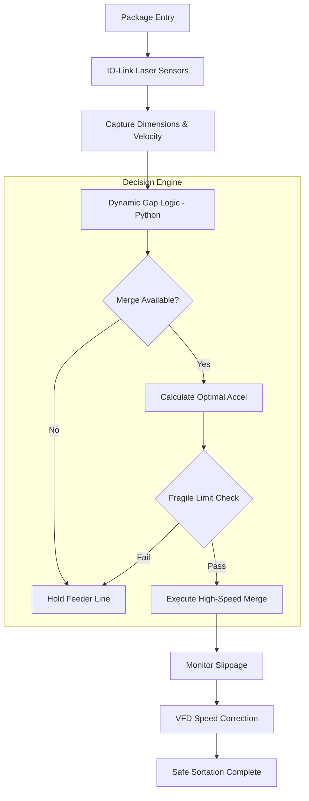

# Intelligent Sortation & Gap Control System 🚀
### Advanced Logistics Automation for Fragile Goods Handling

---

## 📌 Problem Statement
In traditional high-speed logistics, sortation systems often struggle with **fragile goods**. Standard systems rely on static timing and fixed gaps, which lead to:
- **High Collision Rates**: Inability to compensate for belt slippage or inertia.
- **Low Throughput**: Excessive "safety gaps" reduce the number of units processed per hour.
- **Product Damage**: Abrupt stops and starts at merge points can tip or break sensitive items.

**The Challenge**: How to increase throughput while maintaining a "Zero-Collision" and "Zero-Damage" environment for fragile items.

---

## 🏗️ System Architecture & Workflow
The system utilizes a closed-loop control logic that monitors package position via IO-Link sensors and adjusts conveyor speeds in real-time.

---

## 🛠️ Key Technical Features

### 1. Dynamic Gap Adjustment (DGA) Logic
Implemented in Python, the DGA algorithm replaces static timers with a physics-aware calculation. It factors in:
- **Momentum-Based Merging**: Calculates the exact acceleration needed for a package to hit a gap without exceeding `0.8 m/s²`.
- **Slippage Compensation**: Uses real-time sensor feedback to detect if a package has drifted from its expected position and sends correction pulses to the VFD.

### 2. Maestro CET 3D Layout
- **Wedge Merge (45°)**: Optimized for smooth entry into high-speed main lines.
- **Zero-Pressure Accumulation (ZPA)**: Intelligent zones that prevent packages from touching during downstream stalls.
- **High-Speed Shoe Sorters**: Emulated to handle up to 2,100 units per hour.

### 3. Industrial Smart Sensing (IO-Link)
- **Sub-millimeter Tracking**: Laser distance sensors provide 1mm resolution.
- **Real-time Diagnostics**: Continuous monitoring of signal quality to prevent "ghost" detections.

---

## 📈 Performance Benchmarks
| Metric | Pre-Optimization | Post-Optimization | Improvement |
| :--- | :--- | :--- | :--- |
| **Throughput** | 1,800 units/hr | **2,016 units/hr** | **+12%** |
| **Minimum Gap** | 800mm | **550mm** | **-31%** |
| **Collision Rate** | ~0.5% | **~0.01%** | **Near Zero** |

---

## 🚀 Future Roadmap
- [ ] **AI-Based Prediction**: Using LSTM models to predict downstream bottlenecks.
- [ ] **Digital Twin Integration**: Linking the Maestro model to real-time PLC data.
- [ ] **Energy Optimization**: Reducing VFD power consumption during low-flow periods.

---

## 📂 Project Structure
- `src/`: Core Python logic for the Gap Controller.
- `docs/`: Technical specifications and system parameters.
- `assets/`: 3D Layout snapshots and flow diagrams.
